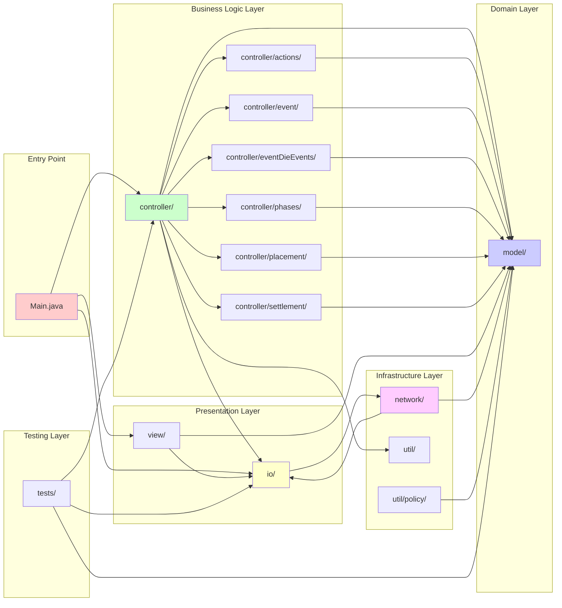
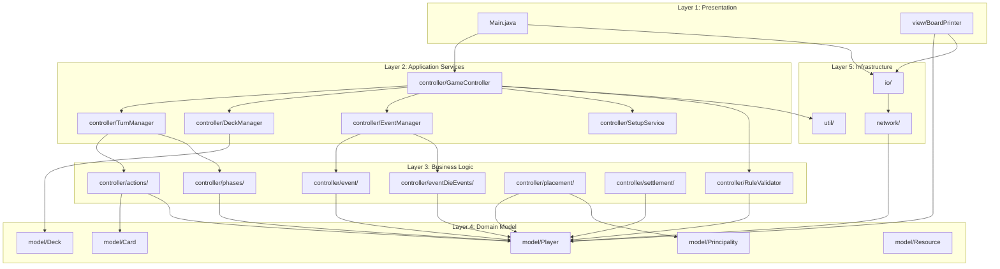
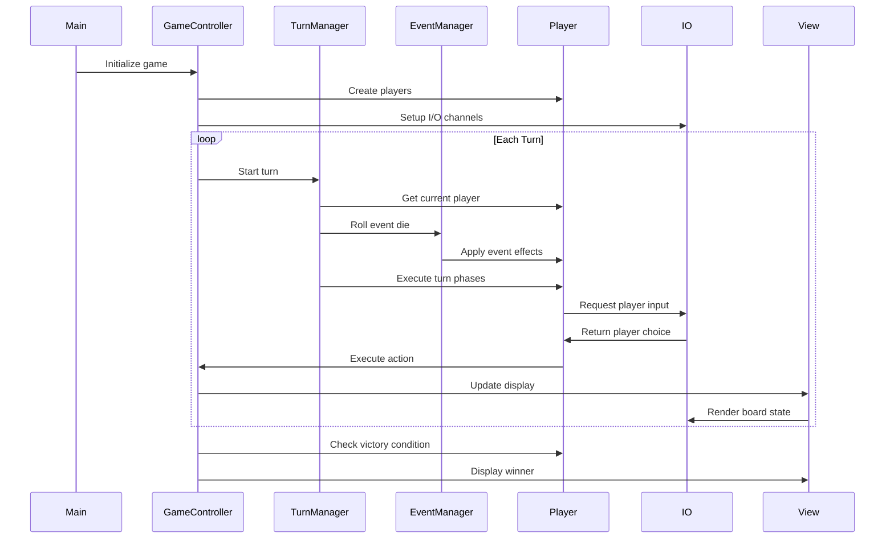

# Folder Connection Overview

This document illustrates how the different packages/folders are connected and interact with each other.

## Package Dependencies and Relationships

## Detailed Package Interaction Diagram

```mermaid
graph TB
    subgraph "Client Entry"
        Main["Main.java<br/>Application Entry Point"]
    end

    subgraph "User Interface"
        View["view/<br/>BoardPrinter"]
        IOLayer["io/<br/>Console/Socket/Mock IO"]
        IOInterfaces["io/interfaces/<br/>IPlayerIO, IInput/OutputService"]
    end

    subgraph "Core Controller"
        GameController["GameController<br/>Main game coordinator"]
        TurnManager["TurnManager<br/>Turn sequencing"]
        DeckManager["DeckManager<br/>Card management"]
        EventManager["EventManager<br/>Event coordination"]
        CardFactory["CardFactory<br/>Card creation"]
        RuleValidator["RuleValidator<br/>Rule enforcement"]
        EffectRegistry["EffectRegistry<br/>Effect registration"]
        SetupService["SetupService<br/>Game initialization"]
        GameContext["GameContext<br/>Shared state"]
    end

    subgraph "Effect Implementations"
        Actions["actions/<br/>Card effects:<br/>Goldsmith, Merchant, etc."]
        Events["event/<br/>Event effects:<br/>Feud, Invention, etc."]
        EventDie["eventDieEvents/<br/>Die outcomes:<br/>Brigand, Trade, etc."]
        Settlement["settlement/<br/>Buildings & Units"]
    end

    subgraph "Game Flow"
        Phases["phases/<br/>PreRollPhase"]
        Placement["placement/<br/>Placement handlers"]
    end

    subgraph "Domain Models"
        Card["Card hierarchy:<br/>Basic, Event, Center"]
        Player["Player & Principality"]
        Deck["Deck"]
        Resources["Resources & Points"]
    end

    subgraph "Network Layer"
        Server["Server & ServerHandler"]
        ClientConn["ClientConnection"]
        OnlinePlayer["OnlinePlayer"]
        NetworkService["NetworkService"]
    end

    subgraph "Utilities"
        Dice["Dice & Randomizer"]
        Config["GameConfig"]
        Logger["Logger"]
        CostParser["CostParser"]
        Policies["policy/<br/>Game policies"]
    end

    %% Main connections
    Main --> GameController
    Main --> IOLayer
    Main --> View

    %% Controller orchestration
    GameController --> TurnManager
    GameController --> DeckManager
    GameController --> EventManager
    GameController --> RuleValidator
    GameController --> SetupService
    GameController --> GameContext

    %% Factory pattern
    CardFactory --> Card
    CardFactory --> EffectRegistry

    %% Effect execution flow
    GameController --> Actions
    GameController --> Events
    EventManager --> EventDie
    GameController --> Phases
    GameController --> Placement
    GameController --> Settlement

    %% Effects interact with models
    Actions --> Player
    Events --> Player
    EventDie --> Player
    Settlement --> Player

    %% Placement flow
    Placement --> Player
    Placement --> RuleValidator

    %% Model interactions
    Player --> Card
    Player --> Deck
    Player --> Resources

    %% View rendering
    View --> Player
    View --> IOLayer

    %% IO abstraction
    IOLayer --> IOInterfaces
    GameController --> IOInterfaces

    %% Network multiplayer
    Server --> ClientConn
    ClientConn --> OnlinePlayer
    OnlinePlayer --> Player
    OnlinePlayer --> IOLayer
    NetworkService --> Server

    %% Utilities used throughout
    GameController --> Dice
    GameController --> Config
    GameController --> Logger
    DeckManager --> CostParser
    RuleValidator --> Policies

    style Main fill:#ff9999
    style GameController fill:#99ff99
    style Card fill:#9999ff
    style IOLayer fill:#ffff99
    style Server fill:#ff99ff
```

## Layer Architecture

## Communication Flow

## Key Relationships

### 1. **Controller → Model**
   - Controllers orchestrate game logic
   - Models maintain game state
   - One-way dependency: Controller uses Model

### 2. **Controller → IO**
   - Controllers use IO for player interaction
   - IO abstracts console vs network
   - Dependency Injection via interfaces

### 3. **Network → IO**
   - Network implements IO interfaces
   - Enables remote gameplay
   - Same interface as console

### 4. **View → Model**
   - View reads model state
   - View uses IO for output
   - No direct model modification

### 5. **Effects → Model**
   - All effects (actions, events, settlements) modify Player/Principality
   - Registered in EffectRegistry
   - Invoked by GameController

### 6. **Util → (Used by all)**
   - Provides cross-cutting concerns
   - Dice, Config, Logger, Policies
   - No dependencies on other packages
