# Folder and Class Structure

This document provides a comprehensive view of the project's folder and class structure.

## Detailed Folder/Class Structure Diagram

```mermaid
graph TD
    subgraph "Root"
        Main[Main.java]
    end

    subgraph "model/"
        Card[Card.java]
        BasicCard[BasicCard.java]
        EventCard[EventCard.java]
        CenterCard[CenterCard.java]
        Deck[Deck.java]
        Player[Player.java]
        Principality[Principality.java]
        Resource[Resource.java]
        Structure[Structure.java]
        RegionTile[RegionTile.java]
        VictoryPointTracker[VictoryPointTracker.java]
        Points[Points.java]
    end

    subgraph "controller/"
        GameController[GameController.java]
        TurnManager[TurnManager.java]
        DeckManager[DeckManager.java]
        EventManager[EventManager.java]
        CardFactory[CardFactory.java]
        RuleValidator[RuleValidator.java]
        EffectRegistry[EffectRegistry.java]
        EffectCatalog[EffectCatalog.java]
        GameContext[GameContext.java]
        SetupService[SetupService.java]
        TurnState[TurnState.java]
        AdvantageManager[AdvantageManager.java]
        ICardEffect[ICardEffect.java]
        
        subgraph "controller/interfaces/"
            IGameController[IGameController.java]
            IDeckProvider[IDeckProvider.java]
            IEventHandler[IEventHandler.java]
            IRuleValidator[IRuleValidator.java]
        end
        
        subgraph "controller/actions/"
            BrigittaEffect[BrigittaTheWiseEffect.java]
            GoldsmithEffect[GoldsmithEffect.java]
            HarvestEffect[HarvestEffect.java]
            MerchantCaravan[MerchantCaravanEffect.java]
            MerchantEffect[MerchantEffect.java]
            PreRollEffect[PreRollEffect.java]
            RelocationEffect[RelocationEffect.java]
            RoadBuildingEffect[RoadBuildingEffect.java]
            Scout[Scout.java]
        end
        
        subgraph "controller/event/"
            FeudEffect[FeudEffect.java]
            FraternalFeud[FraternalFeudsEffect.java]
            InventionEvent[InventionEventEffect.java]
            TradeShipsRace[TradeShipsRaceEffect.java]
            TravelingMerchant[TravelingMerchantEffect.java]
            YearOfPlenty[YearOfPlentyEffect.java]
            YuleEffect[YuleEffect.java]
        end
        
        subgraph "controller/eventDieEvents/"
            BrigandEffect[BrigandEffect.java]
            CelebrationEffect[CelebrationEffect.java]
            EventCardEffect[EventCardEffect.java]
            TradeEffect[TradeEffect.java]
        end
        
        subgraph "controller/phases/"
            PreRollPhase[PreRollPhase.java]
        end
        
        subgraph "controller/placement/"
            PlacementHandler[PlacementHandler.java]
            PlacementRegistry[PlacementRegistry.java]
            CoordinatePrompter[CoordinatePrompter.java]
            AbbeyPlacement[AbbeyPlacementHandler.java]
            CityPlacement[CityPlacementHandler.java]
            HeroPlacement[HeroPlacementHandler.java]
            ParishHallPlacement[ParishHallPlacementHandler.java]
            RegionPlacement[RegionPlacementHandler.java]
            RoadPlacement[RoadPlacementHandler.java]
            SettlementPlacement[SettlementPlacementHandler.java]
            GenericBuildingPlacement[GenericBuildingPlacementHandler.java]
        end
        
        subgraph "controller/settlement/buildings/"
            AbbeyEffect[AbbeyEffect.java]
            MarketplaceEffect[MarketplaceEffect.java]
            StorehouseEffect[StorehouseEffect.java]
            TollBridgeEffect[TollBridgeEffect.java]
        end
        
        subgraph "controller/settlement/units/"
            CommonHeroEffect[CommonHeroEffect.java]
            CommonTradeShip[CommonTradeShipEffect.java]
            LargeTradeShip[LargeTradeShipEffect.java]
        end
    end

    subgraph "view/"
        BoardPrinter[BoardPrinter.java]
    end

    subgraph "io/"
        ConsoleInput[ConsoleInput.java]
        ConsoleOutput[ConsoleOutput.java]
        SocketInput[SocketInput.java]
        SocketOutput[SocketOutput.java]
        MockIO[MockIO.java]
        
        subgraph "io/interfaces/"
            IPlayerIO[IPlayerIO.java]
            IInputService[IInputService.java]
            IOutputService[IOutputService.java]
        end
    end

    subgraph "network/"
        Server[Server.java]
        ServerHandler[ServerHandler.java]
        ClientConnection[ClientConnection.java]
        OnlinePlayer[OnlinePlayer.java]
        NetworkService[NetworkService.java]
        
        subgraph "network/interfaces/"
            INetworkHandler[INetworkHandler.java]
            IConnection[IConnection.java]
            IMessageProtocol[IMessageProtocol.java]
        end
    end

    subgraph "util/"
        Dice[Dice.java]
        Logger[Logger.java]
        Randomizer[Randomizer.java]
        GameConfig[GameConfig.java]
        CostParser[CostParser.java]
        
        subgraph "util/policy/"
            PlacementPolicy[PlacementPolicy.java]
            ProductionPolicy[ProductionPolicy.java]
            TradePolicy[TradePolicy.java]
            VictoryPolicy[VictoryPolicy.java]
            
            subgraph "util/policy/impl/"
                BasePolicies[BasePolicies.java]
            end
        end
    end

    subgraph "tests/"
        AbbeyTest[AbbeyTest.java]
        BrigittaTest[BrigittaPreRollTest.java]
        CityTests[CityUpgradeTest.java]
        EventTests[EventCardsTest.java]
        GoldsmithTests[GoldsmithHappyTest.java]
        HeroesTest[HeroesTest.java]
        MarketplaceTest[MarketplaceTest.java]
        PlacementTests[PlacementRulesTest.java]
        ProductionTests[ProductionBoostersTest.java]
        OtherTests[...and more test files]
    end

    Main --> GameController
    Main --> ConsoleInput
    Main --> ConsoleOutput
```



## Simplified Tree Structure

```
HomeExam/
├── src/
│   ├── Main.java
│   │
│   ├── model/                          # Domain models and game entities
│   │   ├── Card.java
│   │   ├── BasicCard.java
│   │   ├── EventCard.java
│   │   ├── CenterCard.java
│   │   ├── Deck.java
│   │   ├── Player.java
│   │   ├── Principality.java
│   │   ├── Resource.java
│   │   ├── Structure.java
│   │   ├── RegionTile.java
│   │   ├── VictoryPointTracker.java
│   │   └── Points.java
│   │
│   ├── controller/                     # Game logic and control flow
│   │   ├── GameController.java         # Main game coordinator
│   │   ├── TurnManager.java            # Turn sequencing
│   │   ├── DeckManager.java            # Deck operations
│   │   ├── EventManager.java           # Event handling
│   │   ├── CardFactory.java            # Card creation
│   │   ├── RuleValidator.java          # Rule enforcement
│   │   ├── EffectRegistry.java         # Effect registration
│   │   ├── EffectCatalog.java          # Effect catalog
│   │   ├── GameContext.java            # Game state context
│   │   ├── SetupService.java           # Game initialization
│   │   ├── TurnState.java              # Turn state tracking
│   │   ├── AdvantageManager.java       # Advantage tracking
│   │   ├── ICardEffect.java            # Effect interface
│   │   │
│   │   ├── interfaces/                 # Controller interfaces
│   │   │   ├── IGameController.java
│   │   │   ├── IDeckProvider.java
│   │   │   ├── IEventHandler.java
│   │   │   └── IRuleValidator.java
│   │   │
│   │   ├── actions/                    # Action card effects
│   │   │   ├── BrigittaTheWiseEffect.java
│   │   │   ├── GoldsmithEffect.java
│   │   │   ├── HarvestEffect.java
│   │   │   ├── MerchantCaravanEffect.java
│   │   │   ├── MerchantEffect.java
│   │   │   ├── PreRollEffect.java
│   │   │   ├── RelocationEffect.java
│   │   │   ├── RoadBuildingEffect.java
│   │   │   └── Scout.java
│   │   │
│   │   ├── event/                      # Event card effects
│   │   │   ├── FeudEffect.java
│   │   │   ├── FraternalFeudsEffect.java
│   │   │   ├── InventionEventEffect.java
│   │   │   ├── TradeShipsRaceEffect.java
│   │   │   ├── TravelingMerchantEffect.java
│   │   │   ├── YearOfPlentyEffect.java
│   │   │   └── YuleEffect.java
│   │   │
│   │   ├── eventDieEvents/             # Event die outcomes
│   │   │   ├── BrigandEffect.java
│   │   │   ├── CelebrationEffect.java
│   │   │   ├── EventCardEffect.java
│   │   │   └── TradeEffect.java
│   │   │
│   │   ├── phases/                     # Game phase handlers
│   │   │   └── PreRollPhase.java
│   │   │
│   │   ├── placement/                  # Placement logic
│   │   │   ├── PlacementHandler.java
│   │   │   ├── PlacementRegistry.java
│   │   │   ├── CoordinatePrompter.java
│   │   │   ├── AbbeyPlacementHandler.java
│   │   │   ├── CityPlacementHandler.java
│   │   │   ├── HeroPlacementHandler.java
│   │   │   ├── ParishHallPlacementHandler.java
│   │   │   ├── RegionPlacementHandler.java
│   │   │   ├── RoadPlacementHandler.java
│   │   │   ├── SettlementPlacementHandler.java
│   │   │   └── GenericBuildingPlacementHandler.java
│   │   │
│   │   └── settlement/                 # Settlement-specific effects
│   │       ├── buildings/
│   │       │   ├── AbbeyEffect.java
│   │       │   ├── MarketplaceEffect.java
│   │       │   ├── StorehouseEffect.java
│   │       │   └── TollBridgeEffect.java
│   │       └── units/
│   │           ├── CommonHeroEffect.java
│   │           ├── CommonTradeShipEffect.java
│   │           └── LargeTradeShipEffect.java
│   │
│   ├── view/                           # Display and rendering
│   │   └── BoardPrinter.java
│   │
│   ├── io/                             # Input/Output abstractions
│   │   ├── ConsoleInput.java
│   │   ├── ConsoleOutput.java
│   │   ├── SocketInput.java
│   │   ├── SocketOutput.java
│   │   ├── MockIO.java
│   │   └── interfaces/
│   │       ├── IPlayerIO.java
│   │       ├── IInputService.java
│   │       └── IOutputService.java
│   │
│   ├── network/                        # Network multiplayer support
│   │   ├── Server.java
│   │   ├── ServerHandler.java
│   │   ├── ClientConnection.java
│   │   ├── OnlinePlayer.java
│   │   ├── NetworkService.java
│   │   └── interfaces/
│   │       ├── INetworkHandler.java
│   │       ├── IConnection.java
│   │       └── IMessageProtocol.java
│   │
│   ├── util/                           # Utility classes
│   │   ├── Dice.java
│   │   ├── Logger.java
│   │   ├── Randomizer.java
│   │   ├── GameConfig.java
│   │   ├── CostParser.java
│   │   └── policy/                     # Game policy abstractions
│   │       ├── PlacementPolicy.java
│   │       ├── ProductionPolicy.java
│   │       ├── TradePolicy.java
│   │       ├── VictoryPolicy.java
│   │       └── impl/
│   │           └── BasePolicies.java
│   │
│   └── tests/                          # Unit tests
│       ├── AbbeyTest.java
│       ├── BrigittaPreRollTest.java
│       ├── CityImmediateWinTest.java
│       ├── CityUpgradeTest.java
│       ├── EventCardsTest.java
│       ├── GoldsmithHappyTest.java
│       ├── GoldsmithInsufficientTest.java
│       ├── HeroesTest.java
│       ├── LTSParityTest.java
│       ├── MarketplaceTest.java
│       ├── MerchantCaravanDoubleDiscardTest.java
│       ├── MerchantCaravanHappyTest.java
│       ├── ParishHallExchangeDiscountTest.java
│       ├── PlacementRulesTest.java
│       ├── ProductionBoostersTest.java
│       ├── RelocationTest.java
│       ├── ScoutCardTest.java
│       ├── StorehouseTest.java
│       ├── TollBridgeTest.java
│       └── TradeShipsTest.java
│
├── cards.json                          # Card definitions
├── gson.jar                            # JSON library
├── pom.xml                             # Maven configuration
├── README.md
├── ARCHITECTURE.md
├── DESIGN_REPORT.md
└── TEST_SUMMARY.md
```
