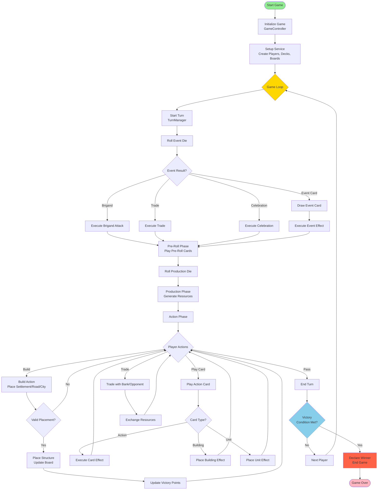
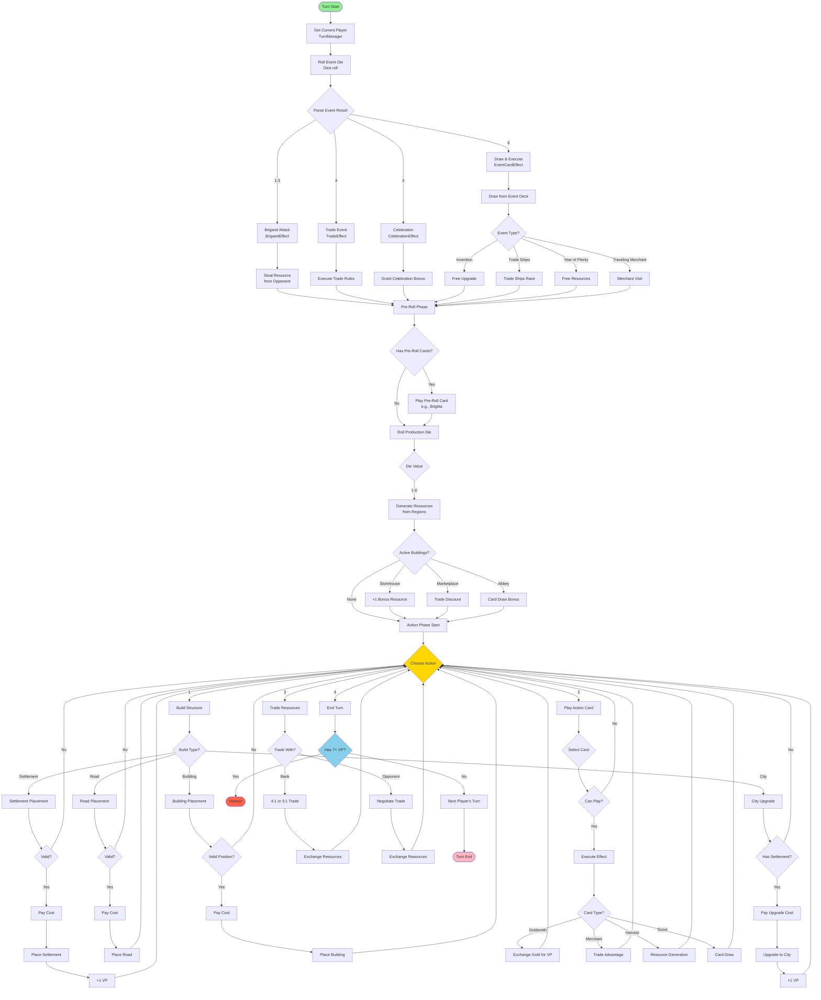
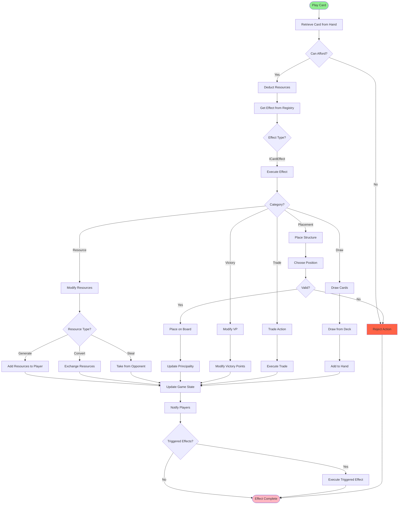
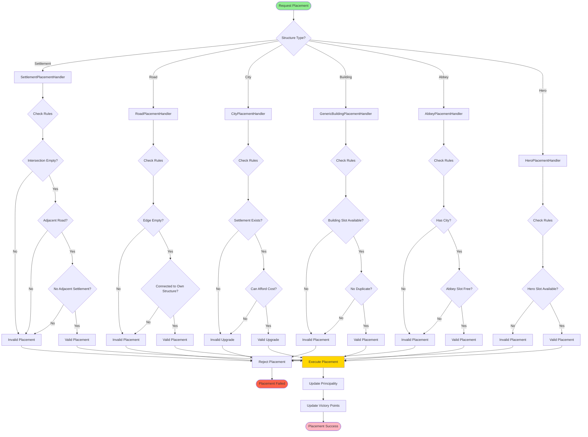
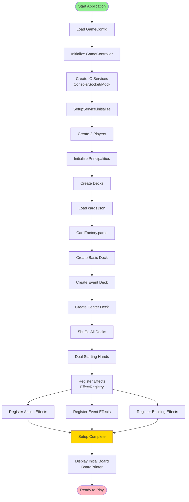
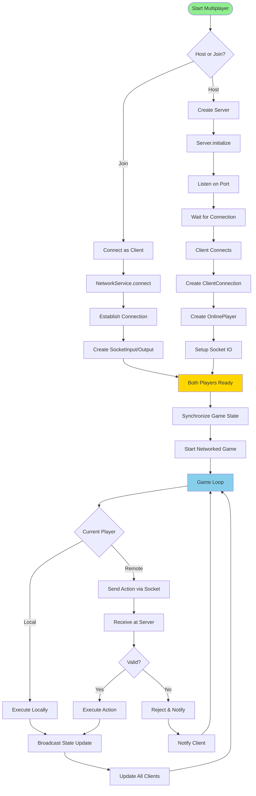

# Game Flow Diagram

This document illustrates the game flow and control flow through the application.

## Main Game Flow

## Detailed Turn Flow

## Card Effect Execution Flow

## Placement Validation Flow

## Initialization Flow

## Multiplayer Network Flow

